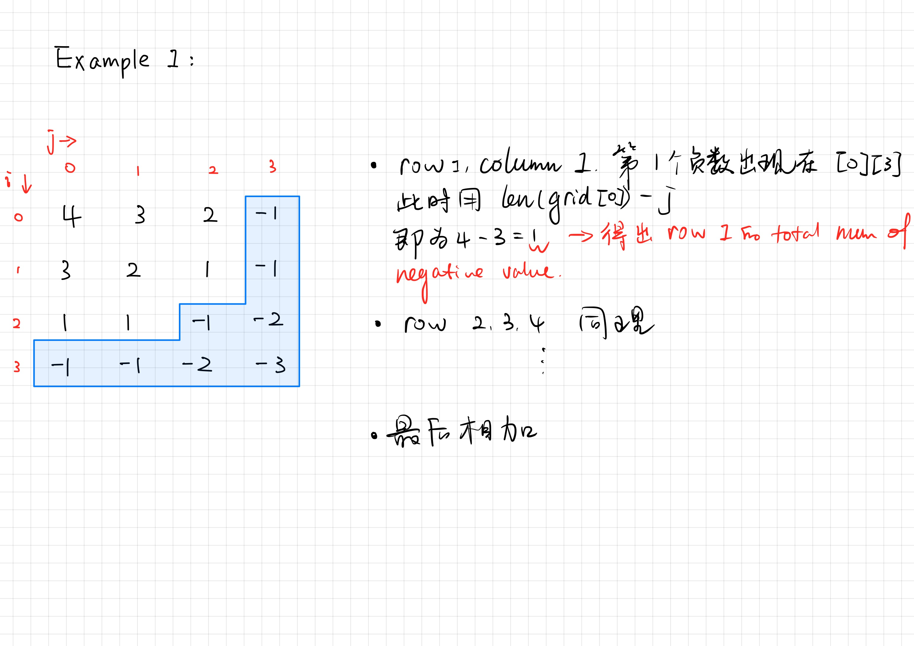

# Leetcode \#1351

## 首先先看题目：

* 给定一个M\*N的从大到小排序好的矩阵grid，找出这个矩阵内所有的负数。

Example 1:

```python
Input: grid = [[4,3,2,-1],[3,2,1,-1],[1,1,-1,-2],[-1,-1,-2,-3]]
Output: 8
Explanation: There are 8 negatives number in the matrix.
```

Example 2:

```python
Input: grid = [[3,2],[1,0]]
Output: 0
```

Example 3:

```python
Input: grid = [[1,-1],[-1,-1]]
Output: 3
```

Example 4:

```python
Input: grid = [[-1]]
Output: 1
```

Constraints:

```python
m == grid.length
n == grid[i].length
1 <= m, n <= 100
-100 <= grid[i][j] <= 100
```

## 解题思路

* 暴力法：
  * 使用双指针 **i** 和 **j**，遍历这个矩阵所有的值，找出所有负数并累加，附上代码：
  * ```python
    class Solution:
        def countNegatives(self, grid: List[List[int]]) -> int:
            total = 0
            for item in grid:
                for num in item:
                    if num < 0:
                        total +=1
            return total
    ```
* 暴力法优化：
  *  
  * 使用双指针**i** 和 **j**，遍历这个矩阵所有的值，当找到某一行里的第一个负数，停止遍历，用总列数减去 **j** 当时的值，便可得出这一行负数的总数量，然后叠加，即可得出答案，附上代码：
  * ```python
    class Solution:
        def countNegatives(self, grid: List[List[int]]) -> int:
            total_negative = 0
            p = len(grid)   #length of rows of the matrix "grid"
            q = len(grid[0])    #length of columns of the matrix "grid"
            for i in range(0,p):
                for j in range(0,q):
                    if grid[i][j] < 0:
                        neg = q - j
                        total_negative += neg
                        break
            return total_negative
    ```
* 二分法（待更新）

